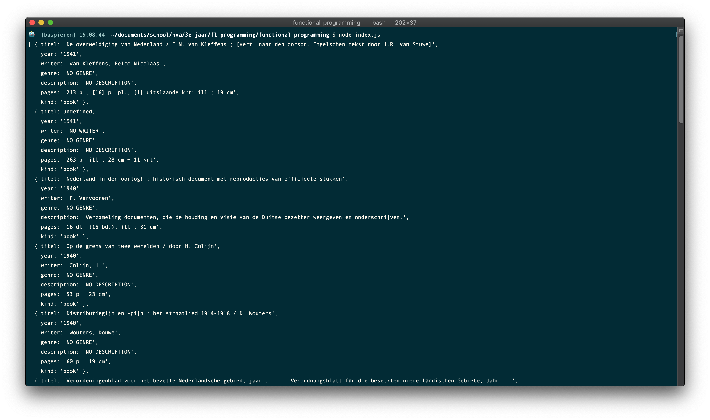

# functional-programming ⚙️

This is the repo for my functional programming project.



## Table of Contents 🗃
* [To Do](#to-do-)
* [Description](#description-)
* [Installing](#installing-)
  * [Packages and technologies](#packages-and-technologies)
* [Research](#research-)
  * [Data](#data)
  * [Research questions](#research-questions)
  * [Hypothesis](#hypothesis)
  * [Sub-questions](#sub-questions)
  * [Variables](#variables)
  * [Findings](#findings)
* [Sources](#sources-)
* [Licence](#licence-)

## To Do 📌
This is a list of things in want to do in this project.
- [ ] Git, npm, and d3 are used; the project runs without errors; data is loaded with d3; there is a representation of data.
- [ ] Data is rendered with d3; interpreting the representation is easier that interpreting the data itself.
- [ ] d3 is used to clean data and make a dynamic representation; data is functionally transformed.
- [ ] Representation and use of d3 go beyond an example: there are demonstrable additions like a well-chosen scale.
- [ ] Changes persist across page reloads.
- [ ] The way the student applies subject matter is more advanced than what they were taught in class; let’s switch places.

## Description 📝
During this project I used d3 to make a clean data presentation using the OBA API. I did research based on the data which I used to formulate a research question, sub-questions and hypothesis.

## Installing 🔍
To install this application enter the following into your terminal:
```
git clone https://github.com/BasPieren/functional-programming.git

cd functional-programming

npm install rijkvanzanten/node-oba-api

npm install
```

### Packages and technologies
This project makes use of the following packages and technologies:

* [node-oba-api](https://github.com/rijkvanzanten/node-oba-api)
* [dotenv](https://www.npmjs.com/package/dotenv)

## Research 📑
This is the research I have done in the first week of the project.

### Data
First after getting back the data from the [OBA API](https://zoeken.oba.nl/api/v1/) I looked through the data to see what kind of properties it was holding. The data was structured somewhat like this:

<details><summary>Data Structure</summary>
<ul>
<li>id</li>
<li>frabl</li>
<li>detail-page</li>
<li>coverimages</li>
  <ul>
    <li>coverimage</li>
  </ul>
<li>titles</li>
  <ul>
  <li>title</li>
  <li>short-title</li>
  <li>other-title</li>
  </ul>
<li>authors</li>
  <ul>
  <li>main-author</li>
  <li>author</li>
  </ul>
<li>formats</li>
  <ul>
  <li>format</li>
  <li>identifiers</li>
  <li>isbn-id</li>
  <li>ppn-id</li>
  </ul>
<li>publication</li>
  <ul>
  <li>year</li>
  <li>publishers</li>
  </ul>
    <ul>
    <li>publisher</li>
    <li>edition</li>
    </ul>
<li>classification</li>
  <ul>
  <li>siso-code</li>
  </ul>
<li>languages</li>
  <ul>
  <li>language</li>
  </ul>
<li>subjects</li>
  <ul>
  <li>topical-subject</li>
  </ul>
<li>genres</li>
  <ul>
  <li>genre</li>
  </ul>
<li>description</li>
  <ul>
  <li>physical-description</li>
  </ul>
<li>summaries</li>
  <ul>
  <li>summary</li>
  </ul>
<li>notes</li>
  <ul>
  <li>note</li>
  </ul>
<li>target-audiences</li>
  <ul>
  <li>target-audience</li>
  <li>undup-info</li>
  </ul>
</ul>
</details>

<br>
I went looking for variables that I could use for my project. I expected to find properties like: title, writer, genre and publication date of books. Quickly I saw that there was a lot of excess data that was not really needed.

### Research questions
After exploring the data I came up with the following research questions:

1.	Were fewer books written after the year 2000?
2.	Has the number of audiobooks grown in the past 10 years?
3.	Have more "cheerful" genres been used in the period after 1940-1945?
4.	Have there been fewer books written about faith / religion through the course of the years?
5.	Do men and women often continue to write within the same kind of genres?

These where things I thought that would be interesting to know and that was based on variables that could be found inside the data. Out of all these questions I choose the one that I found the most interesting:

**Have more "cheerful" genres been used in the period after 1940-1945?**

But I still found the part about the "cheerful genres" to still be a bit to abstract and vague. So I made an iteration on it:

**Have there been noticeable changes in genres that have been used in the period after World War 2?**

_EDIT:_ After I went through the sorted data to find patterns I noticed that a lot of books didn't have a genre. Almost all of them did have a description so I decided to focus on that instead of the genre. So I also changed my research question:

**Have there been noticeable changes in the sort of books that have been written in the period after World War 2?**

### Hypothesis
After I formulated my research questions I came up with a hypothesis that I wanted to test.

- **"After World War 2 books have drastically changed in genre to reflect the time period."**

_EDIT:_ When I changed my research question I also changed my hypothesis:

- **"After World War 2 books have drastically changed in subjects to reflect the time period."**

### Sub-questions
After I finalized my research question and hypothesis I started to write down sub-questions about things I wanted to know about:

- Which genres are most commonly used 5 years after World War 2?
- Which genres are most commonly used during World War 2?
- Have genres been added after World War 2?
- Who wrote books after World War 2?
- Who wrote books during World War 2?
- What where books about after World War 2?
- What where books about during World War 2?

I wanted to focus on the period during and after World War 2 so that I would have a base that I could use to compare my hypothesis to.

### Variables
After I wrote down my sub-questions I started to look at the properties inside the data that I thought I would need to find patterns. I came up with the following:

- Titel
- Author
- Format
- Publication Year
- Pages
- Subjects

I made sure that I would only get back these variables when searching trough the data.

### Findings
The first thing that I noticed when looking through books from before World War 2 is that a lot are about the aftermath of World War 1 and especially about the individual stories of soldiers. Descriptions for example are (in Dutch):

- Een Rus die in de Eerste Wereldoorlog en daarna tijdens de Russische Revolutie carrière gemaakt heeft door zijn botte onverschilligheid voor het welzijn van anderen komt tot inkeer en sterft na jaren van ascese als een heilige. | 1934
- Een jonge Fransman moet zijn vrouw in Parijs achterlaten wanneer hij tijdens de Eerste Wereldoorlog als soldaat naar het front gestuurd wordt. | 1935
- Een jongeman die na de Eerste Wereldoorlog in zijn Russische dorpje terugkeert, wordt door niemand begrepen als hij verteldt dat hij gelovig is geworden. | 1937

Later during the early years of World War 2, books where about the new situation that was developing in the world.

- Analyse van de politieke situatie in Nazi-Duitsland voor de Tweede Wereldoorlog, door een Australisch historicus. | 1938
- Kroniek van de eerste maanden van de Tweede Wereldoorlog: september 1939-februari 1940. | 1939
- Studie over de toekomstvoorspellingen van de Franse astroloog, met name met betrekking tot de Tweede Wereldoorlog. | 1940
- Verzameling documenten, die de houding en visie van de Duitse bezetter weergeven en onderschrijven. | 1940

After World War 2 a lot of books look back on the war, the events that happend and the different people who lost their lives or offered resistance against the oppressors.

- Kunst in het harnas : gedachtenis-tentoonstelling ter ere van gevallen en vervolgde kunstenaars | 1945
- Nederlandsch-Indië en Japan : hun betrekkingen in 1940-1941 | 1945
- Monetaire vraagstukken tijdens en na den oorlog | 1945
- Het verzet van de Nederlandsche bisschoppen tegen nationaal-socialisme en Duitsche tyrannie | 1945

Some books also took a more lighthearted approach and celebrated the end of the war.

- Programma der feestelijkheden op 26, 27 en 28 Juni 1945 ter viering van de bevrijding der hoofdstad uit Duitschen druk | 1945
- Vrijheid : tijdgedichten en berijmde schotschriften | 1945
- Van dollen Dinsdag tot de bevrijding | 1945
- Vrij! | 1945

A lot of books where written in 1945 detailing different events in World War 2. Later when we approach 1950 and the years that follow a lot less books where written about World War 2. Maybe this is because people where tired of hearing and reading about it?

## Sources 📚

* [OBA API](https://zoeken.oba.nl/api/v1/)
* [node-oba-api](https://github.com/rijkvanzanten/node-oba-api)
* [How to return part of string after a certain character?](https://stackoverflow.com/questions/16470113/how-to-return-part-of-string-after-a-certain-character)
* [Readme by Daniel van de Velde](https://github.com/DanielvandeVelde/functional-programming/blob/master/README.md)
* [Code provided by Martijn Reeuwijk](https://github.com/MartijnReeuwijk)

## Licence 🔓
MIT © [Bas Pieren](https://github.com/BasPieren)
