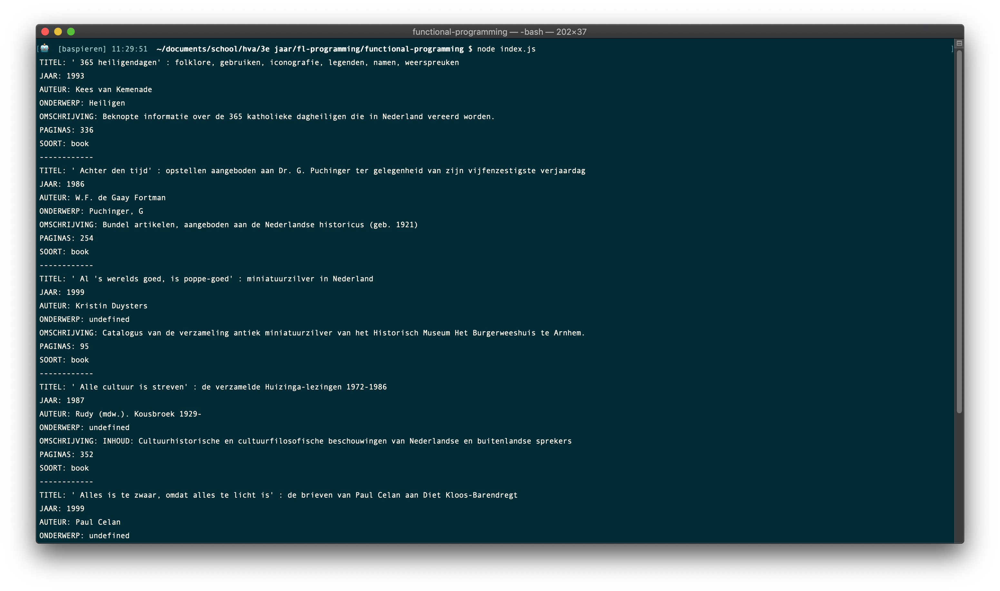

# functional-programming ⚙️

This is the repo for my functional programming project.



## Table of Contents 🗃
* [To Do](#to-do-)
* [Description](#description-)
* [Installing](#installing-)
  * [Packages and technologies](#packages-and-technologies)
* [Research](#research-)
  * [Data](#data)
  * [Research questions](#research-questions)
  * [Hypothesis](#hypothesis)
  * [Sub-questions](#sub-questions)
  * [Variables](#variables)
  * [Findings](#findings)
* [Sources](#sources-)
* [Licence](#licence-)

## To Do 📌
This is a list of things in want to do in this project.
- [ ] Git, npm, and d3 are used; the project runs without errors; data is loaded with d3; there is a representation of data.
- [ ] Data is rendered with d3; interpreting the representation is easier that interpreting the data itself.
- [ ] d3 is used to clean data and make a dynamic representation;data is functionally transformed.
- [ ] Representation and use of d3 go beyond an example: there are demonstrable additions like a well-chosen scale.
- [ ] Changes persist across page reloads.
- [ ] The way the student applies subject matter is more advanced than what they were taught in class; let’s switch places.

## Description 📝


## Installing 🔍
To install this application enter the following into your terminal:
```
git clone https://github.com/BasPieren/functional-programming.git

cd functional-programming

npm install rijkvanzanten/node-oba-api

npm install
```

### Packages and technologies
This project makes use of the following packages and technologies:

* [node-oba-api](https://github.com/rijkvanzanten/node-oba-api)
* [dotenv](https://www.npmjs.com/package/dotenv)

## Research 📑
This is the research I have done in the first week of the project.

### Data
First after getting back the data from the [OBA API](https://zoeken.oba.nl/api/v1/) I started to look through the data to see what kind of values it was holding. The data was structured somewhat like this:

<details><summary>Data Structure</summary>

<ul>
<li>id</li>
<li>frabl</li>
<li>detail-page</li>
<li>coverimages</li>
  <ul>
    <li>coverimage</li>
  </ul>
<li>titles</li>
  <ul>
  <li>title</li>
  <li>short-title</li>
  <li>other-title</li>
  </ul>
<li>authors</li>
  <ul>
  <li>main-author</li>
  <li>author</li>
  </ul>
<li>formats</li>
  <ul>
  <li>format</li>
  <li>identifiers</li>
  <li>isbn-id</li>
  <li>ppn-id</li>
  </ul>
<li>publication</li>
  <ul>
  <li>year</li>
  <li>publishers</li>
  </ul>
    <ul>
    <li>publisher</li>
    <li>edition</li>
    </ul>
<li>classification</li>
  <ul>
  <li>siso-code</li>
  </ul>
<li>languages</li>
  <ul>
  <li>language</li>
  </ul>
<li>subjects</li>
  <ul>
  <li>topical-subject</li>
  </ul>
<li>genres</li>
  <ul>
  <li>genre</li>
  </ul>
<li>description</li>
  <ul>
  <li>physical-description</li>
  </ul>
<li>summaries</li>
  <ul>
  <li>summary</li>
  </ul>
<li>notes</li>
  <ul>
  <li>note</li>
  </ul>
<li>target-audiences</li>
  <ul>
  <li>target-audience</li>
  <li>undup-info</li>
  </ul>
</ul>

</details>

<br>
After I had access to the data I started to look through all the data for things I could use for my project like the title, writer, genre and publication date of books. Quickly I saw that there was a lot of excess data that was not really needed.

### Research questions
After exploring the data I came up with the following research questions:

1.	Were fewer books written after the year 2000?
2.	Has the number of audiobooks grown in the past 10 years?
3.	Have more "cheerful" genres been used in the period after 1940-1945?
4.	Have there been fewer books written about faith / religion through the course of the years?
5.	Do men and women often continue to write within the same kind of genres?

These where things I thought that would be interesting to know and that could be found inside the data. Out of all these questions I choose the one that I found the most interesting.

I choose the following question:

**Have more "cheerful" genres been used in the period after 1940-1945?**

But I still found the part about the "cheerful genres" to still be a bit to abstract and vague. So I made an iteration on it.

**Have there been noticeable changes in genres that have been used in the period after World War 2?**

### Hypothesis
After I formulated my research questions I came up with a hypothesis that I wanted to test.

**"After World War 2 books have drastically changed in genre to reflect the time period."**

### Sub-questions
After I finalized my research question I started to write down sub-questions about things I wanted to know:

- Which genres are most commonly used 5 years after World War 2?
- Which genres are most commonly used during World War 2?
- Have genres been added after World War 2?
- Who wrote books after World War 2?
- Who wrote books during World War 2?
- What where the books about after World War 2?
- What where the books about during World War 2?

### Variables
After I wrote down my sub-questions I started to write down the variables inside the data that I thought I would need to find patterns. I came up with the following:

- Titel
- Author
- Format
- Publication Year
- Pages
- Subjects

### Findings


## Sources 📚

* [node-oba-api](https://github.com/rijkvanzanten/node-oba-api)
* [How to return part of string after a certain character?](https://stackoverflow.com/questions/16470113/how-to-return-part-of-string-after-a-certain-character)
* [Code provided by Martijn Reeuwijk](https://github.com/MartijnReeuwijk)

## Licence 🔓
MIT © [Bas Pieren](https://github.com/BasPieren)
